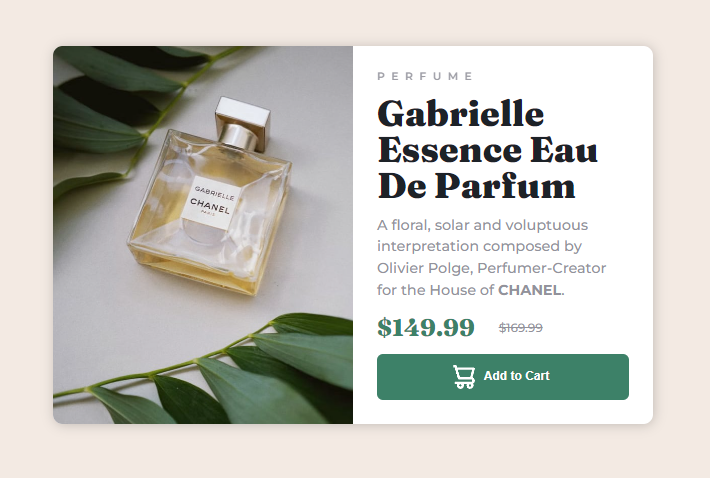

# Frontend Mentor - Product preview card

This is a solution to the [Product preview card component challenge on Frontend Mentor](https://www.frontendmentor.io/challenges/product-preview-card-component-GO7UmttRfa). Frontend Mentor challenges help you improve your coding skills by building realistic projects.

## Table of contents

- [Overview](#overview)
  - [The challenge](#the-challenge)
  - [Screenshot](#screenshot)
  - [Links](#links)
- [My process](#my-process)
  - [Built with](#built-with)
  - [What I learned](#what-i-learned)
- [Author](#author)

## Overview

### The challenge

Users should be able to:

- View the optimal layout depending on their device's screen size
- See hover and focus states for interactive elements

### Screenshot




### Links

- Solution URL: [My solution URL](https://www.frontendmentor.io/challenges/product-preview-card-component-GO7UmttRfa/hub/product-preview-card-simple-htmlcss-solution-i7WsCmwnkZ)
- Live Site URL: [GitPages](https://brunobwn.github.io/product-preview-card/)

## My process

### Built with

- Semantic HTML5 markup
- CSS custom properties
- Flexbox

### What I learned

Something interesting that I've learned in this project is the use of <code><source></code> tag inside a <code><picture></code>, to change the source of an image according to the screen resolution (or other css query). By doing this we can reduce download sizes to users on mobile, by changing to small image files.

An exemple applied in this project:

```html
<picture>
  <source media="(max-width: 660px)" srcset="images/image-product-mobile.jpg" />
  
</picture>
```

## Author

- Linkedin - [Bruno's Linkedin](https://www.linkedin.com/in/brunoberwian/)
- Frontend Mentor - [@brunobwn](https://www.frontendmentor.io/profile/brunobwn)
